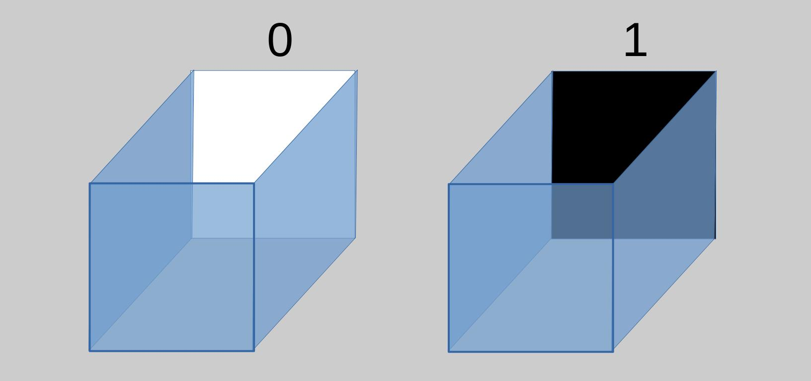
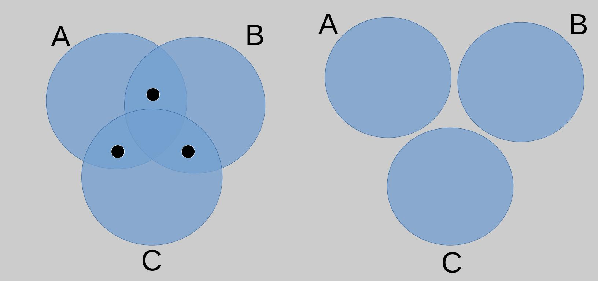
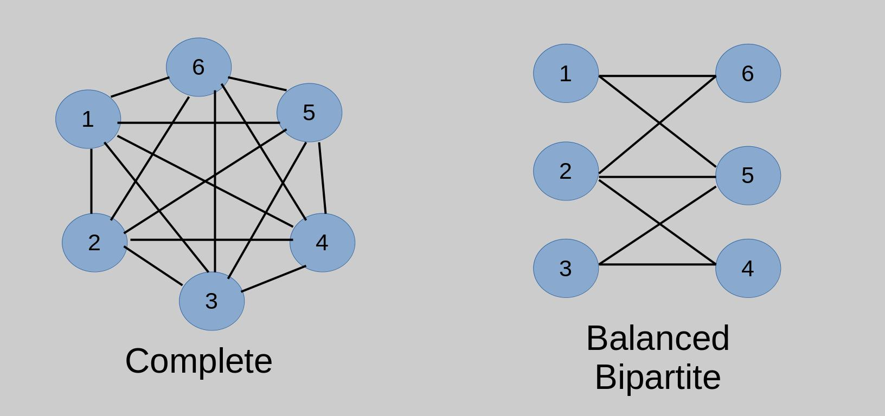

## Preface
In this post we initiate an exercise which we claim is of interest for anyone interested in _quantum-computing_. We justify the accessibility of this post by the fact that the author is not rigorously trained in mathematics. For researchers, What we pose here serves as a joke for them. For high-school students, undergraduates, or even the lay audience, It serves as an insightful yet approachable exercise. In either cases, This post contributes to the good of society. No _quantum-mechanics_ or _quantum-computing_ background is assumed. In fact, A goal of this post is to pave the reader's way for further readings in _quantum algorithms_.

## Overview
The first two sections, _Quantum Parallelism The Big Promise But Not So Obvious_ and _Quantum-interference-alike Classical Problem_ are background intros to _quantum computing_. In their own rights, They serve as a popular science blog post. The contribution of this blog begins with the section following them, _Quantum-interference-alike Classical Problem_. Finally, We end this blog post with personal retrospection and a call-out for my other fellow students to continue advancing the pathway this post paves.

The popular science part attempts to show how hard quantum algorithm design is, As it is very counter intuitive, Even for the physicist. Then it proceeds to the problem Deutsch-Josza's algorithm solves without any technical treatment of the algorithm.

Then our contribution comes where we try to contrive classical problems which follow the same spirit as quantum-interference pattern in quantum algorithms.

___

## Table of Contents
- [Preface](#preface)
- [Overview](#overview)
- [Quantum Parallelism The Big Promise But Not So Obvious](#quantum-parallelism-the-big-promise-but-not-so-obvious)
    - [Superposition](#superposition)
    - [Measurement](#measurement)
    - [Heroic Computer Scientists](#heroic-computer-scientists)
- [Deutsch-Josza's Algorithm](#deutsch-joszas-algorithm)
    - [The Problem It Solves](#the-problem-it-solves)
    - [Quantum-interference](#quantum-interference)
- [Quantum-interference-alike Classical Problem](#quantum-interference-alike-classical-problem)
    - [Approach 1: Number of Non-empty Intersections](#approach-1-number-of-non-empty-intersections)
    - [Approach 2: Complete or Balanced-Bipartite?](#approach-2-complete-or-balanced-bipartite)
- [Personal Remarks](#personal-remarks)
    - [Learning Progress](#learning-progress)
    - [Too Quickly](#too-quickly)
- [Further: You Could Contribute](#further-you-could-contribute)
- [References](#references)
___

## Quantum Parallelism: The Big Promise But Not So Obvious
The central promise of _quantum computing_ lies in _quantum parallelism_ where one-step operation computes many states simultaneously. In classical computing, if $c_0 = false$ and $c_1 = true$, Reversing both bits requires two operations. But for a _quantum-bit_ $q$, It might exist in a _superposition_ of $true$ and $false$ where one-step reversing operation on $q$ accounts for reversing both $true$ and $false$. So, Applying a set of operations on one $q$ saves us half the operations if we were applying them on two classical bits, $c_0$ and $c_1$. But what happens when you read $q$? Do you get the two resulting states? The answer is **NO**. Measuring $q$ yields only one state of the two. And that state is chosen randomly.

So, Could we benefit from _quantum parallelism_ if _measurement_ yields only one _state_? And what is meant by _superposition_?

### Superposition

In popular media articles, It is common to draw an analogy by a coin, Where _heads_ represents $true$ and _tails_ represents $false$, so that a _superposition coin_ is a coin in-between both of them.

Personally speaking, I find such analogy **misleading**. If we interpreted $true$ as $1$ and $false$ as $0$, Then what the coin-analogy might indicate is that a _superposition_ is $0.5$, which is totally a mistaken interpretation.

Philosophers attempted to interpret _superposition_ in different ways. For them, It is very gratifying that a new physics-paradigm defied philosophical assumptions which were once taken for granted by physicists. Yet, Even after _quantum-mechanics_, Philosophers stil feel unappreciated.

Try to think with me on the following:

You bought a new video-game and after running it, It turned-out the game contains no quality-content but repeats itself in a fatigue open-world quests. Then suddenly, A bug occurs where you fell in the cube above such that all the walls you see are the blue ones.

We wish to think of the wall you did not see as a _superposition wall_ of colors _black_ and _white_, and think of moving your _mouse_ or your _right analog stick_ so that a pixel of the _superposition wall_ appears at your screen, As measuring the _superposition wall_.

So, you move your _mouse_ until the _superposition wall_ appears at your screen. Then, You find-out this wall is colored white. As nothing interests you, You restart the game in hope of not falling into the same bug. However, As games are shipped via _crunshing_ these days, You fall again into the bug. Again, You move your mouse but this time you find the _superposition wall_ colored black! The third time, black; the forth time, white. 

Probably, You think the _superposition wall_ color was determined once you restarted the game. However, That is not the case. The wall was neither black nor white. It got _collapsed_ into one of these states once a pixel of the wall appeared at your screen. In other words, The wall's state is determined only when you measure it!

You might be wondering the following. If this game is nothing but a software code running, Then this weird _superposition_ state is just some programming error. As it is technically feasible to trace the code, i.e follow-up the program's variables line-by-line, Then we could determine the _superposition wall_ color, Given the gamer's input. Hence, Nothing is weird and everything is safely explainable.

That concern is correct. Anyway, For the sake of this analogy, Try to think of the game appearing at your screen as the observable natural world, and the software code as something unknownable beyond our realm. All what you have got as a gamer is the graphics you are seeing but not beyond that. Similarly, All what physicists have is the natural world but not beyond that.

So, again, What is meant by that _superposition_? **No one knows**. 

### Measurement
If reading a qubit, i.e _quantum bit_, Shows only one state among many, Then wouldn't that render _quantum parallelism_ as useless? In addition, The state measured is selected randomly. So, Afterall, If we obtain a random state, Why don't we just use a _psuedo-random-number-generator_? In other words, Why should we celebrate doing one-step operation on many states of the _quantum_ world, If we could only read the result of only one of these states?

### Heroic Computer Scientists
That was messy. _Superpositions_ are confusing physicists; Measurements do not show us the whole results of computation. Yet, On a heroic movement, Computer scientists attempt to engineer _superposition_ states, Whereby a probabilistic measurement outcome, Enables them to conclude answers to algorithmic problems! Computer scientists are aspiring to utilize what physicists do not understand; To reach **nearly** certain answers from probabilistic measurements!

This is a big reason why the physics community is interested in _quantum computing_. It is believed if computer scientists succeeded in figuring some pattern of quantum-mechanical computations, Then physicists will gain some insight about their quantum-mechanics theory.

## Deutsch-Josza's Algorithm
Let me present you _Deutsch-Josza_'s algorithm. Particularly, I show the problem it solves, and its trick, Without any mathematical details. Nonetheless, We claim our blog post captures an interesting insight of the algorithm. We assure the reader all what he requires to read the algorithm is high-school linear algebra, and refer him to _[YM]_ for a more complete treatment.

### The Problem It Solves
Think of a software made by Apple. Probably you guessed it isn't compatable with anything but Apple's ecosystem. As usual, Apple imposes strict policies:

- **(1)** You cannot see the software's inner source-code, You can only enter some input and the software responds with an output. So, You cannot know how the software computes the output shown to you.

Apple emails you that some of your group were granted a promotion. In order to know whom was granted, Enter the pin-code of each of your group in the software.

- **(2)** That input pin-code is composed of only zeros and ones.

Rumors about the promotion policy confirmed to you

- **(3)** Either
    - **(1)** All your group have the same result. That is, All your group was granted the promotion or None of your group was granted it; Or
    - **(2)** Exactly half of your group got the promotion and the other half did not.

As you are curious more about leaking news, Your goal is not to know specifically whom of your group got the promotion. Rather, 

- **(4)** Given the software provided by Apple, You wish to know which of the two above policies, Namely **(3)**, Apple is following.

If you are lucky enough, Two trials showing two different results is sufficient to confirm you Apple's policiy **(3-2)**. In worst case, You will need to use Apple's software half the number of your group in addition to one.

Deutsch-Josza's Algorithm solves this problem using Apple's software only one time!

In more technical terms, You are given a function $f:\set{ 0, 1}^n \rightarrow \set{0, 1}$ which accepts a binary string of size n and outputs 0 or 1. You need to determine whether the function is _balanced_ or _constant_, and you are assured it is exlusively either cases. You cannot see its definition, All the interaction you have with the function is evaluating inputs on it.

### Quantum-interference
Qubit's measurement, i.e reading a quantum state, is probabilistic. For instance, State $\ket{+}$ has a 50-50 chance to yield $0$ and $1$. Through _Deutsch–Jozsa_'s algorithm, The qubit's state measurement probabilities depend on the given function $f$. Via the illustrated above analogy, Apple's policy **(3)** determine probabilities of reading the resulting qubit. Particularly, The probability of measuring $\ket{0}$,

- If $f$ is _constant_, is 1; and
- If $f$ is _balanced_, is 0

So, Upon only one measurement, We could safely conclude whether function $f$ is _balanced_ or _constant_. For example, If we run _Deutsch–Jozsa_'s algorithm and obtained any result other than $\ket{0}$, Then certainly $\ket{0}$'s probability is 0 and hence $f$ is _balanced_.

## Quantum-interference-alike Classical Problem
Strictly speaking, We shall no longer deal with quantum computing Nonetheless, We don't give up on tackling the trick _Deutsch-Josza_'s algorithm achieved. Namely, _quantum-interference_.

We propose the following approach:
- **Input**: A mathematical object known to have one of well-defined characteristics.
- **Initial state**: A vector or whatever object which represents probabilities.
- **Encoding**: A set of matrices, or whatever operations, which are applied to - initial state. Those somehow depend on the input or encode it in someway.
- **Execution**: Apply encoded operations on the state.
- **Reflection**: The final state is ought to reflect the input's characteristic.

This approach follows the same spirit implemented in nearly every quantum algorithm including _Deutsch-Josza_ illustrated above. If this relaxed version taught us something, Then hopefully we obtain a new insight on quantum algorithms, By trying to relate obtained results back to quantum circuits.

### Approach 1: Number of Non-empty Intersections

Let's think of a simple concrete example, Then generalize the approach. As shown in the above picture for the left diagram, We are given sets $A, B, C$ and told there is a non-empty intersection, i.e some elements, common in $A$ and $B$; $A$ and $C$; and, $B$ and $C$. We have a great number of non-empty intersections, and in fact this is a characteristic we wish to detect. Also, we wish to detect if we have low number of non-empty intersections, As is the case for the right diagram. 

We detect both of these characteristics as follows:
- Set a variable $x = 0$, Then 
- List all possible intersections: $(A, B)$, $(A, C)$, $(B, C)$.
- For each possible intersection, Increment $x$ by one if it occurs on given sets, i.e there are some elements between the two sets; and Decrease $x$ otherwise, i.e The intersection is empty.

For the left diagram, We would have $x = 0 + 1 + 1 + 1 = 3$. For the right diagram, $x = 0 - 1 - 1 - 1 = -3$.

In more technical and general terms, The approach here is as:
- **Input**: Sets, $A, B, \dots$, whose distinguishing characteristic is the number of non-empty intersections among them
- **Initial State**: A vector whose length is the number of sets plus one. First element is $0$ and remaining ones are $1$
$$
\ket{\psi_0} = 
\begin{bmatrix}
0 \newline
1 \newline
\vdots \newline
1
\end{bmatrix}
$$

- **Encoding**: A matrix for each set $X$ which encodes whether all other sets have a non-empty intersection with it.

$$
A_m = 
\begin{bmatrix}
1 & 0 & b_a & c_a & \dots & z_a \newline
0 & 1 & 0   & 0   & \dots & 0   \newline
0 & 0 & 1  & 0   & \dots & 0   \newline
\vdots
\end{bmatrix}
$$

$$
B_m = 
\begin{bmatrix}
1 & a_b & 0 & c_b & \dots & z_b \newline
0 & 1 & 0   & 0   & \dots & 0   \newline
0 & 0 & 1  & 0   & \dots & 0   \newline
\vdots
\end{bmatrix}
$$

Where the element in (first-row, first-column) is always one; The rest of the elements in the first row, $x_y$, represents whether set $y$ has a non-empty intersection with set $x$. Specifically, It equals $1$ if there is, and $-1$ if there is not.

- **Execution**: We multiply encoded matrices, $A_m, B_m, \dots$, by $\ket{\psi_0}$. Then, We take the absolute values of $\ket{\psi_n}$
- **Reflection**: The first element of the final state $\ket{\psi_{n+1}}$ is great only if the number of intersections is either too low or too many.

**Naively** speaking, We wish to think of elements of state $\ket{\psi_i}$ as probabilities. We wish also to think of measuring the state $\ket{\psi_i}$ as, reading an index, whereby a greater element's probability indicates we are more likely to measure the index corresponding to it.

In our case, We are more likely to measure index $0$ if the number of non-empty intersections is high or low.

### Approach 2: Complete or Balanced-Bipartite?

Similarly, Let’s pick-up a simple concrete example, Then generalize. We are given two graphs, _complete_ $c$ and _balanced-bipartite_ $b$. They are encoded straight-forwardly by a matrix where cell $(i, j)$ is 1 if nodes $i$ and $j$ are connected, and 0 otherwise. For graph $c$ It is

$$
\begin{bmatrix}
0 & 1 & 1 & 1 & 1 & 1 \newline
1 & 0 & 1 & 1 & 1 & 1 \newline
1 & 1 & 0 & 1 & 1 & 1 \newline
1 & 1 & 1 & 0 & 1 & 1 \newline
1 & 1 & 1 & 1 & 0 & 1\newline
1 & 1 & 1 & 1 & 1 & 0
\end{bmatrix}
$$

For graph $b$ it is

$$
\begin{bmatrix}
0 & 0 & 0 & 0 & 0 & 1 \newline
0 & 0 & 0 & 1 & 1 & 0 \newline
0 & 0 & 0 & 0 & 1 & 0 \newline
0 & 1 & 0 & 0 & 0 & 0 \newline
0 & 1 & 1 & 0 & 0 & 0\newline
1 & 0 & 0 & 0 & 0 & 0
\end{bmatrix}
$$

Upon multiplying by an initial state

$$
\ket{\psi_0} =
\begin{bmatrix}
0 \newline
0 \newline
0 \newline
1 \newline
1 \newline
1
\end{bmatrix}
$$

The graph $c$ swaps zeros with non-zers, Moving the first three zeros to the bottom. For graph $b$, No zero is going to remain.

Again, In more technical and general terms:
- **Input**: A graph known to be _complete_ or _balanced-bipartite_.
- **Initial state**: Vector

$$
\ket{\psi_0} =
\begin{bmatrix}
0 \newline
\vdots \newline
0 \newline
1 \newline
\vdots \newline
1
\end{bmatrix}
$$

where the top part is all zeros and the down part is all ones, and the number of zeros and ones is the same. 

- **Encoding**: The input graph is encoded into a matrix straight-forwardly where cell $(i, j)$ is 1 if nodes $i$ and $j$ are connected, and 0 otherwise.
- **Execution**: multiply the encoded matrix by $\ket{\psi_0}$.
- **Reflection**: If the graph is _balanced-bipartite_, Then zeros in final state $\ket{\psi_n}$ get swapped with non-zeros. If the graph is _complete_, Then the final state $\ket{\psi_n}$ shall contain no zeros.

By _balanced-bipartite_ we mean the number of nodes of both sides is the same. 

**Naively** speaking, We wish to think of elements of state $\ket{\psi_n}$ as probabilities. We wish also to think of measuring the state $\ket{\psi_i}$ as, reading an index, whereby a zero element indicates we are certainly not going to measure the index corresponding to it.

In our case, If we measured final state $\ket{\psi_n}$ couple of times, and obtained indices from both the top and bottom indices, Then we could safely conclude the graph is _complete_. On the other hand, If we obtained only from the bottom indices, Then we could **guess** by a very good probabilistic bound that the graph is _balanced-bipartite_.

There is a concern worth to mention. If the graphs' nodes were labeled differently, Then our **reflection** would not in fact occur. This problem could be mitigated by assuming some label protocol as follows. Let $n$ be the number of nodes. Pick-up a random node then label it by $1$; Traverse to nodes adjacent to it then assign $n, n-1, \dots$ to them. For each last assigned node, Traverse to their adjacent nodes and label $2, 3, \dots$.

## Personal Remarks

### Learning Progress
While results presented here are laughably trivial, I am personally very happy for them. In my previous blog posts:
- **Competitive Programming**, The problem is well-defined, known to have a solution, known how to approach it.
- **NP-Completeness Proof** & **Guarini**, The problem is well-defined, known to have a solution, known how to approach it, Yet the solution is not straight-forward.
- **This Post**, The problem is not well-defined, not known to have a solution, not known how to approach it. Here, I had to somehow envision the approach on a higher-conceptual-level.

That shows there's a progress in my learning.

### Too Quickly
My first reaction when I started planning for this post was, If I am lucky enough I will need to delve deep into discrete mathematics, Hunting for some special structure. Remarkably for me, A trivial result like the two shown above were found only from a quick skim on some definitions on Rosen's book _[Ro]_.

## Further: You Could Contribute
For mainstream researchers, I greatly raise my doubts whether this post would be useful. For anyone else, What I tried to show here is you do not have to learn symbolically tedious math in order to figure a new insight. I am writing this post while I did not complete even an undergrad course in _quantum computing_! I believe anyone with minimal possible background could find a new pattern. Even for quantum circuits, You do not need more than high-school applied linear algebra. It is not that faraway to attempt to relate your findings back to quantum circuits.

## References
- **[YM]** Yanofsky & Mannucci. Quantum Computing for Computer Scientists. Cambridge
- **[Ro]** Rosen. Discrete Mathematics and Its Applications. Pearson
$\require{braket}$
